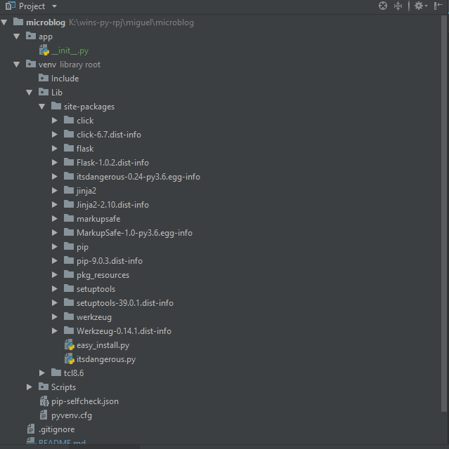

# From the book:  Flask Mega-Tutorial series
#### by `Miguel Grinberg`

# Prepare laptop
    *   create a virtual env
        - cd `microblog`
        - microblog>python -m venv venv
        - microblog>venv\Scripts\activate (make sure that for other projects you need to 
            activate another instance of venv unless sharing the same interpretor)
        - try python CLI and import flask (now if you do not get any error you are good, 
            else you need to pip install flask)
        - pip install flask
        - open pyCharm you should see the below
        
 
 
 test via CLI
 
 
 
 List of pip installs
 *  pip install flask
 *  next
 *  next
 *  next
 
 s       